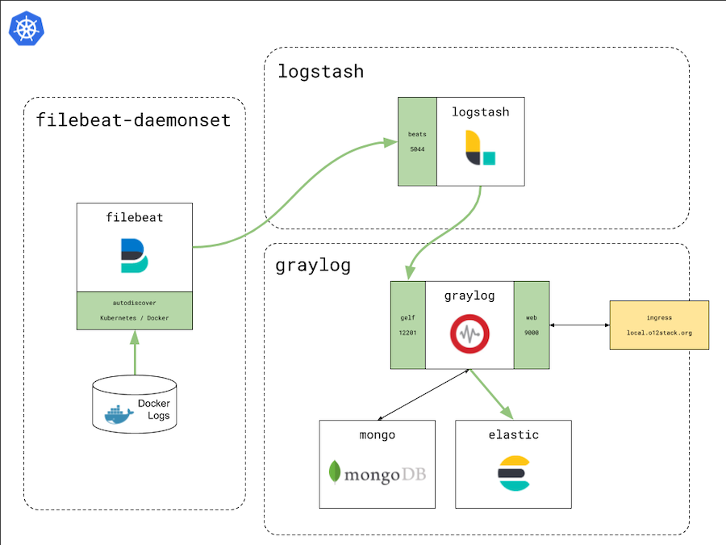
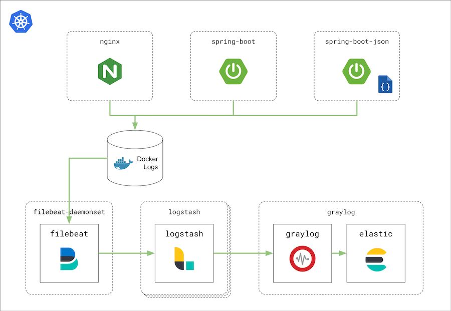

# Logging Demo Stack

In this repo, you find a demo that builds an open source logging stack in Kubernetes using Filebeat, Logstash, Graylog and ElasticSearch.

The logging stack is set up in a `minikube` environment and logs from different sources (test drivers) are fired into it.

## The Logging Stack

The logging stack consists of these components:

* The "ELG" stack
  * running inside the Kubernetes deployments `logstash` and `graylog`
  * `logstash` filters and enriches log records
  * `graylog` manages the indexes and provides a search and management UI
  * `elastic` stores the log records in indexes
  * `mongo` is a Mongo DB that stores metadata for Graylog

* Filebeat
  * running inside a Kubernetes daemonset `filebeat-daemonset` 
  * The daemonset ensures that exactly one pod is running per Kubernetes node (and accordingly one per Docker daemon)
  * `filebeat` reads the Docker outputs of a subset of the running containers of a Kubernetes node

* Communication and Services
  * `logstash` offers a `beats` protocol Kubernetes service listening on port `5044`.
  * `graylog` offers a `gelf` input service to ingest the logs into the index.
  * On the other hand, `graylog` gives access to its web UI via an ingress. 

## The Log Message Flow

Three demo applications ("test drivers") can shoot their logs into the stack at a desired rate. They write their logs to `stdout` where they are captured by the Docker daemon. 

`filebeat` reads the log lines from the Docker log storage and fires them into the pipeline.

## Setup

[Here](docs/MINIKUBE.md) you find the documentation how you set up your dev machine for the demos.

## Running the demo

This section shows you how to run the demo. For further details, please have a closer look at the mentioned config files, we tried to write them as verbose as possible...

### ELG stack

The resources you need for the ELG stack can be found in `demo/stack-elg/'

Once Graylog is running, it will be accessed via `local.o12stack.org`.
To prepare that access, you have to insert a corresponding entry in 
your `/etc/hosts` file. These two commands do the trick:

    sudo sed -i '' '/local.o12stack.org/d' /etc/hosts
    sudo bash -c 'echo "$(minikube ip)    local.o12stack.org" >> /etc/hosts'

Set up the required Kubernetes services/ingresses by applying the corresponding files:

    kubectl apply -f graylog-service.yml
    kubectl apply -f graylog-ingress.yml
    kubectl apply -f logstash-service.yml

The configuration for logstash lives in a `ConfigMap`:

    kubectl apply -f logstash-config.yml

Now, you can do the actual deployments that starts the stack:

    kubectl apply -f graylog-deployment.yml
    kubectl apply -f logstash-deployment.yml

As of now, we cannot configure the Graylog server purely by the means of Kubernetes definitions, so there is a small script that does the rest:

    ./start.sh

The script is quite verbose and takes you to the rest of the setup of the ELG stack. At the end, this script shows you the URL of the Graylog UI where you can (hopefully) see your logs once you completed the startup!

### Filebeat daemonset

The resources you need for the Filebeat DaemonSet can be found in `demo/stack-filebeat/`

The configuration for filebeat lives in a `ConfigMap`:

    kubectl apply -f filebeat-configuration.yml

As filebeat wants to access the Docker logs of the Kubernetes node it is running in, you have to setup some permissions by applying the following file:

    kubectl apply -f filebeat-rbac.yml

(Refer to the file for details...)

Now, you can do the actual deployment that starts filebeat:

    kubectl apply -f filebeat-daemonset.yml

### Logging applications

The applications that fire the logs are some test drivers we provide via DockerHub. Have a look at the corresponding configurations for details.

For each logging application we provide one deployment file inside `demo/applications/`

#### NGINX

This container emits standard web access logs.

    kubectl apply -f nginx-deployment.yml

#### Spring Boot

This container emits logs from a Spring Boot application that uses `log4j2`:

    kubectl apply -f spring-boot-deployment.yml

#### Spring Boot (JSON)

This container emits logs from a Spring Boot application that uses `log4j2` and wraps them in a single line JSON.

    kubectl apply -f spring-boot-json-deployment.yml

## Resources

[Here](docs/LINKS.md) you find some links to docs we found useful while developing this demo.
